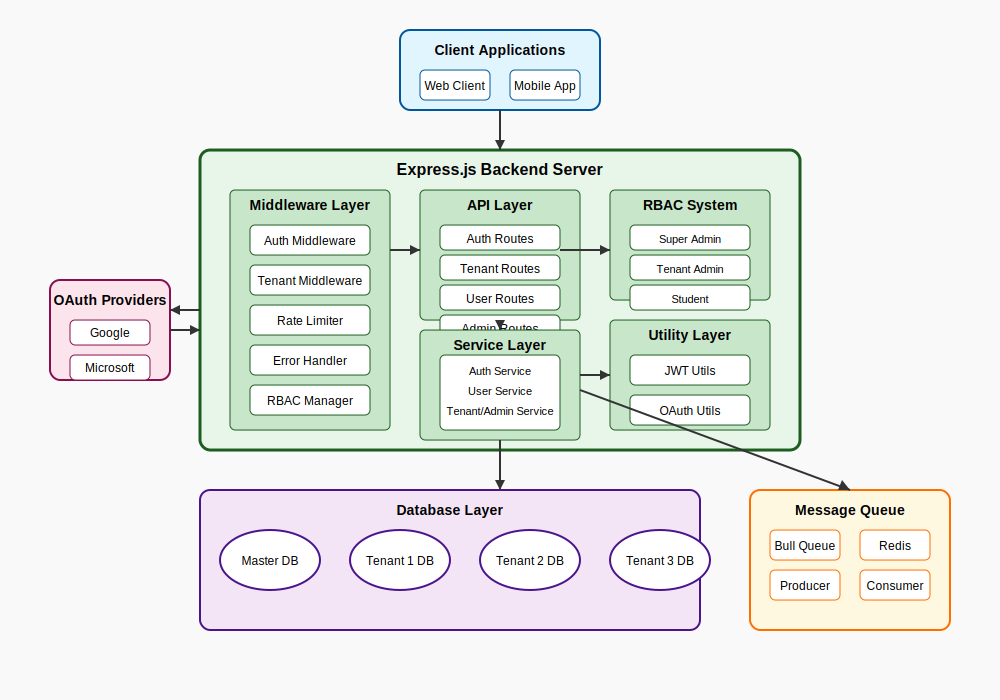
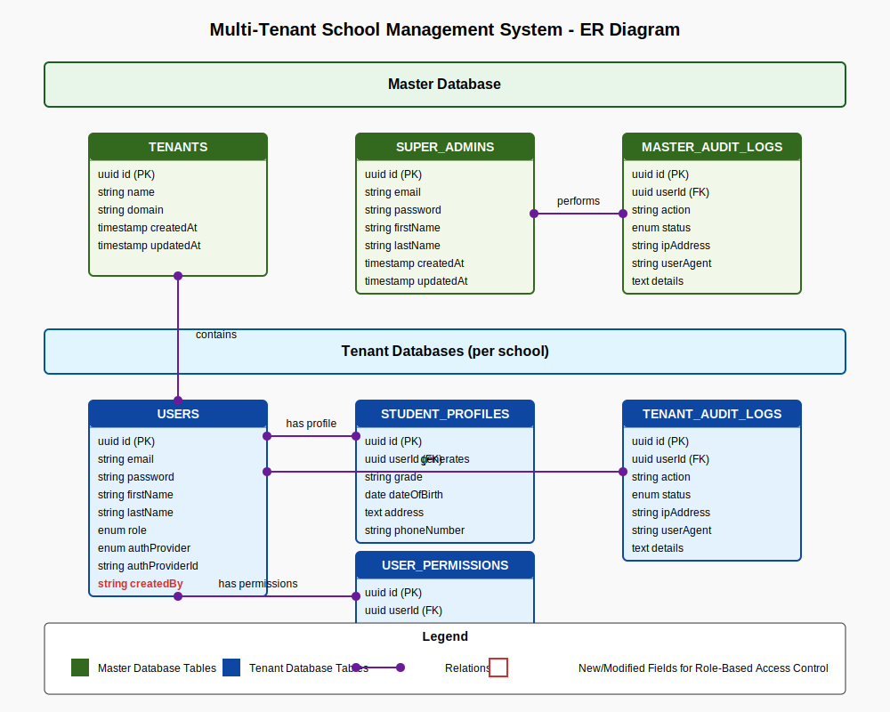
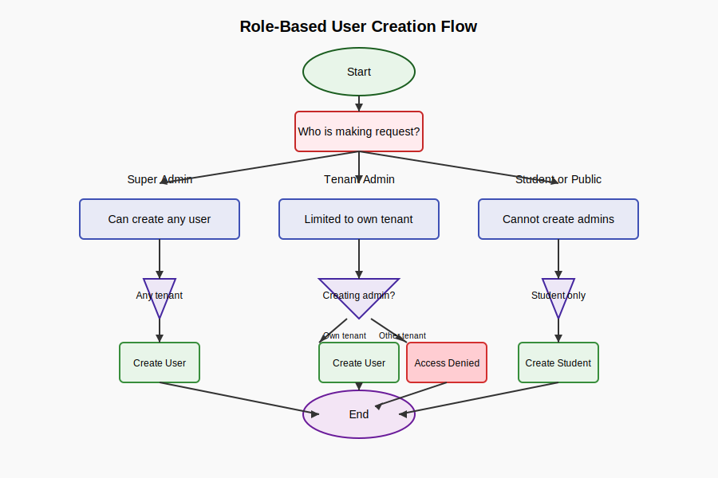

# Multi-Tenant School Management System

A secure, scalable backend API for managing multiple schools with database-level isolation and role-based access control.

## Features

- **Multi-Tenancy**: Database-level isolation with separate database per tenant (school)
- **Authentication & Security**:
  - JWT-based authentication with access and refresh tokens
  - OAuth2 support for Google and Microsoft (Outlook)
  - Password hashing with bcrypt
  - Rate limiting and brute force protection
  - Secure password generation for new tenants
- **Role-Based Access Control (RBAC)**:
  - Super Admins: Manage all tenants/schools and can create any type of user
  - Tenant Admins: Manage users within their school only
  - Students: View their own profile only
- **User Registration Controls**:
  - Public registration limited to student accounts only
  - Admin accounts can only be created by Super Admins or Tenant Admins
  - Tenant Admins can only create users for their own tenant
- **Event-Driven Architecture**:
  - Audit logging with message queue
  - Background processing of events
  - Fallback mechanism when Redis is unavailable
- **Comprehensive Audit Logging**:
  - Track all login attempts
  - Per-tenant isolation of audit data
  - Reporting for administrators

## Architecture Diagram



## Entity Relationship Diagram



## Role-Based User Creation Flow



## Technology Stack

- **Backend**: Node.js with Express
- **Database**: MySQL (separate database per tenant)
- **Authentication**: JWT, OAuth2 (Google & Microsoft)
- **Message Queue**: Bull with Redis
- **Security**: bcrypt, helmet, rate limiting
- **Error Handling**: Centralized error handling with proper status codes

## Prerequisites

- Node.js (v14+)
- MySQL
- Redis (optional, with fallback mechanism)

## Setup

1. Clone the repository:

   ```
   git clone https://github.com/yourusername/school-management-system.git
   cd school-management-system
   ```

2. Install dependencies:

   ```
   npm install
   ```

3. Configure environment variables:

   - Create a `.env` file based on the `.env.example` template
   - Set your database credentials, JWT secret, and OAuth client IDs
   - In production, use a strong, randomly-generated secret for JWT_SECRET

4. Initialize the database:

   ```
   npm run db:init
   ```

   This script creates:

   - The master database with tenant information
   - A super admin account (credentials are displayed in console during initialization)

5. Start the application:

   ```
   npm start
   ```

   For development with auto-restart:

   ```
   npm run dev
   ```

## API Endpoints

### Authentication

- `POST /api/auth/register` - Register a new student (public, limited to student role)
- `POST /api/auth/register-user` - Register a new user (requires authentication)
- `POST /api/auth/login` - Login user (requires tenant ID)
- `POST /api/auth/super-admin/login` - Super admin login
- `POST /api/auth/refresh-token` - Refresh JWT token
- `POST /api/auth/change-password` - Change user password (requires authentication)
- `GET /api/auth/google` - Google OAuth login (requires tenant ID)
- `GET /api/auth/outlook` - Microsoft OAuth login (requires tenant ID)

### User Management

- `GET /api/users` - Get all users (tenant-specific)
- `GET /api/users/:id` - Get user details
- `PATCH /api/users/:id` - Update user
- `DELETE /api/users/:id` - Delete user
- `GET /api/users/:id/profile` - Get student profile
- `PATCH /api/users/:id/profile` - Update student profile

### Tenant Management (Super Admin only)

- `POST /api/tenants` - Create new tenant/school
- `GET /api/tenants` - Get all tenants
- `GET /api/tenants/:id` - Get tenant details
- `PATCH /api/tenants/:id` - Update tenant
- `DELETE /api/tenants/:id` - Delete tenant
- `GET /api/tenants/audit/failed-logins` - Get failed logins across all tenants
- `GET /api/tenants/audit/:tenantId/failed-logins` - Get failed logins for a specific tenant
- `GET /api/tenants/audit/:tenantId/logs` - Get audit logs for a specific tenant

### Admin Operations (Super Admin only)

- `POST /api/admin/tenant-admin` - Create a new admin for a specific tenant
- `POST /api/admin/tenant-with-admin` - Create a new tenant with an admin in one operation

### Student Routes

- `GET /api/student/profile` - Get student's own profile
- `PATCH /api/student/profile` - Update student's own profile

## Authentication Flow

### JWT Authentication

1. User logs in with email/password
2. Server returns access token (short-lived) and refresh token (long-lived)
3. Client includes access token in Authorization header for subsequent requests
4. When access token expires, client uses refresh token to get a new access token

### OAuth Authentication

1. User clicks on "Login with Google/Microsoft"
2. User is redirected to OAuth provider for authentication
3. After successful authentication, provider redirects back to our callback URL
4. Server creates or updates user account and issues JWT tokens
5. User is redirected to the frontend with tokens in query parameters

## Role-Based Access Control Rules

### Super Admin

- Can access all endpoints
- Can manage all tenants
- Can create/modify/delete any user in any tenant
- Can create new tenants with admin accounts

### Tenant Admin

- Limited to their own tenant's data
- Can create/modify/delete users within their tenant only
- Can create both admin and student accounts within their tenant

### Student

- Limited to their own profile
- Cannot create new users
- Can only update their own profile information

## Project Structure

```
school-management-system/
├── config/
│   ├── auth.js
│   └── database.js
├── controllers/
├── middleware/
│   ├── authMiddleware.js
│   ├── errorHandler.js
│   ├── rateLimiter.js
│   └── tenantMiddleware.js
├── models/
├── routes/
├── services/
├── utils/
│   ├── jwtUtils.js
│   └── oauthUtils.js
├── queue/
│   ├── consumer.js
│   └── producer.js
├── scripts/
│   └── init-db.js
├── docs/
│   └── images/
├── app.js
├── server.js
└── package.json
```

## Multi-Tenancy Implementation

This system implements database-level multi-tenancy, where each tenant (school) has its own separate database. This provides the highest level of data isolation between tenants.

- A master database stores tenant information and super admin accounts
- When a new tenant is created, a new database is automatically provisioned
- Each tenant-specific operation connects to the appropriate tenant database
- Request headers use `x-tenant-id` to specify which tenant is being accessed

## Security Considerations

- All passwords are hashed using bcrypt
- JWT tokens have short lifespans to minimize risk from token theft
- Rate limiting prevents brute force attacks
- All authentication events are logged for monitoring
- OAuth integration provides passwordless options
- Database transactions ensure data consistency
- Connection pooling with proper connection management
- Input validation prevents malformed data
- CORS configuration secures API access
- Role-based access controls prevent unauthorized operations

## Error Handling

- Centralized error handling middleware
- Consistent error responses with appropriate status codes
- Detailed error information in development mode only
- Transaction rollbacks on errors to maintain data integrity
- Graceful handling of Redis unavailability

## License

MIT
